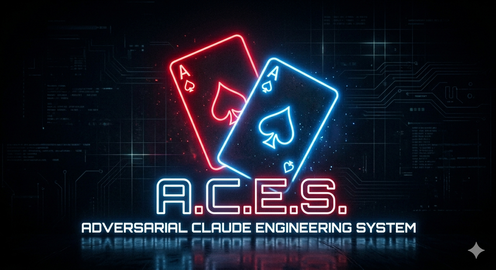

# A.C.E.S.



Based on Anthropic's article covering [harness design for long-running application development](https://www.anthropic.com/engineering/harness-design-long-running-apps), **A.C.E.S.** is a six-agent autonomous software engineering pipeline that transforms a natural-language product concept into a running, tested, full-stack application with minimal human intervention required between start and finish. It was written specifically for use with Claude Code using [Claude Code's sub-agent system](https://docs.anthropic.com/en/docs/claude-code/sub-agents).

The pipeline is structured as an **adversarial minimax game** inspired by GANs: the Generator maximizes a shared scalar (the **Acceptance Score**), while the Architect, Design Critic, and Evaluator collectively minimize it by landing confirmed defects. Confirmed defects are harvested into a persistent, cross-build **attack library** so the discriminators' test surface grows monotonically — preventing the Generator from converging on a fixed beatable rubric. See [Adversarial Game Mechanics](#adversarial-game-mechanics).

## Table of Contents

1. [Quick Start](#1-quick-start)
2. [Pipeline Overview](#2-pipeline-overview)
3. [Adversarial Game Mechanics](#adversarial-game-mechanics)
4. [Optimized for Opus 4.8](#optimized-for-opus-48)
5. [Architecture & Technical Deep Dive](#3-architecture--technical-deep-dive)
6. [File Reference](#4-file-reference)
7. [FAQ](#5-faq)

## 1. Quick Start

### Prerequisites

- [Claude Code CLI](https://docs.anthropic.com/en/docs/claude-code) installed and authenticated
- [GitHub CLI](https://cli.github.com/) installed and authenticated (used to clone the template repo)
- Python 3.12+ (for FastAPI backend, installed by Generator automatically)
- Node.js (installed by Generator automatically as needed)

### Clone the Template Repo

Open a terminal and navigate to the parent directory where you want to create your new project, e.g., `~/repos/`.

Then run: 

```
gh repo create new-project-name --template="benharrisdev81/aces" --private --clone
```

Change into the new directory:


```
cd new-project-name
```


### Starting a New Build

Open Claude Code in this directory and type:

```
Build [your product concept]
```

**Examples:**

```
Build a personal finance tracker with AI-powered spending insights
```

```
Build a Kanban project management tool with an AI assistant that can create and move cards
```

```
Build a recipe app where an AI suggests meals based on ingredients I have on hand
```

```
Build a minimal Markdown note-taking app — no AI features
```

To bypass AI integration entirely, include a clear opt-out in your concept (e.g., "no AI features", "without AI"). The Planner will honor this and omit the AI capabilities section from the spec; the Generator will skip Phase 5; the Evaluator will not test for AI functionality.

The Clarifier will ask up to five targeted questions about your concept — covering success criteria, target user, non-goals, and any key ambiguities that would change what gets built. After you answer, the pipeline runs autonomously: the Planner specs, the Generator builds, the Architect reviews the codebase, the Design Critic reviews for usability, and the Evaluator tests. The only other prompts are when the Design Critic and Evaluator each request browser automation access — at those points, confirm whether Playwright MCP or another browser tool is available. The Architect reviews source code only and does not request browser access.

### Resuming an Interrupted Build

If a build is interrupted (e.g., by a usage limit reset or a closed terminal session):

```
Resume build
```

The orchestrator reads the pipeline state files and re-enters the pipeline at the exact point of interruption — mid-phase if necessary.

### Pausing With Mid-Flight Feedback

To inject feedback, a scope change, or a question into an in-flight build without restarting:

```
Pause build: [your message]
```

The orchestrator appends your message to `pipeline-state/user-intervention.md`. The next Generator pass reads it and treats it as a late spec amendment. Use sparingly — mid-flight changes invalidate work already done.

### Pipeline Complete

When the build passes evaluation, Claude Code will announce:

> "The build has passed evaluation. EVAL_PASS.md and RETROSPECTIVE.md have been written. The pipeline is complete."

Your application is in the `output/` directory. Refer to `HANDOFF.md` for start commands; `RETROSPECTIVE.md` summarizes how the build progressed across rounds.

## 2. Pipeline Overview

### What It Does

This pipeline accepts a plain-language description of a software product and autonomously produces a fully functional, full-stack web application. You describe what you want to build; the pipeline interrogates your concept for ambiguities, produces a comprehensive specification (with acceptance criteria, a domain glossary, and a conceptual data model), builds the application, reviews the codebase for structural quality and security, reviews the live app for usability and accessibility across three viewport sizes, tests it functionally with security probes, and iterates until it passes — surfacing for the initial clarification questions and any mid-flight escalations or conflicts the pipeline encounters (including a missing browser-automation tool, which escalates via `ESCALATION_REQUESTED.md` rather than blocking on an inline question).

The pipeline is built on top of [Claude Code's sub-agent system](https://docs.anthropic.com/en/docs/claude-code/sub-agents), which allows a coordinating orchestrator to spawn specialized agents, each with its own instructions, tool access, and scope of responsibility.

### Order of Operations

```
User Prompt
     │
     ▼
┌─────────────┐
│  Clarifier  │  Interrogates the concept: success criteria, target user, non-goals,
│             │  ambiguities, and constraints/integrations
└──────┬──────┘
       │  clarifier_output.md
       ▼
┌─────────────┐
│   Planner   │  Spec: glossary, conceptual data model, scale targets, originality tier,
│             │  prioritized features with acceptance criteria
└──────┬──────┘
       │  planner_output.md
       ▼
┌─────────────┐
│  Generator  │  Builds the full-stack app; runs type check, lint, tests; per-phase commits;
│             │  writes VERIFY_NOTES.md
└──────┬──────┘
       │  HANDOFF.md + VERIFY_NOTES.md + output/
       ▼
┌─────────────────────────────┬───────────────────────────────┐
│  Architect (concurrent)     │  Design Critic (concurrent)   │
│  Reviews codebase: naming,  │  Reviews live app as          │
│  separation of concerns,    │  non-technical user at 3      │
│  coupling, pattern          │  viewports + i18n probe;      │
│  coherence, scalability,    │  checks WCAG + failure modes  │
│  security boundaries        │                               │
│  (+ AI sub-dimension)       │                               │
└──────────────┬──────────────┴──────────────┬────────────────┘
               │                             │
               └──────────────┬──────────────┘
                              │
                 ┌────────────┴────────────┐
                 │                         │
            both PASS              either FAIL ──► Generator (one combined
                 │                                 revision pass, both reports)
                 │                                       │
                 │◄──────────────────────────────────────┘
                 ▼
┌─────────────┐
│  Evaluator  │  Tests every acceptance criterion, runs security probes, scores Tier 2;
│             │  PASS / CONDITIONAL PASS / FAIL / UNRECOVERABLE
└──────┬──────┘
       │
  ┌────┴─────┐
  │          │
PASS       FAIL ──► Generator (up to 7 rounds) ──► [skip-unaffected reviewers] ──► Evaluator
  │
  ▼
EVAL_PASS.md + RETROSPECTIVE.md written; pipeline complete
```

When the Evaluator issues a failure verdict, the orchestrator re-invokes the Generator with that report as a mandatory input. The Generator revises, the orchestrator inspects what changed, then re-runs the affected reviewers (skipping reviewers whose dimensions are not touched by the revision). This correction loop repeats up to seven rounds before the pipeline declares the build unrecoverable and halts for manual review. A `CONDITIONAL PASS` verdict (used at most once per build) triggers a single targeted Generator fix pass rather than consuming a full round.

### Agent Descriptions

#### Clarifier

The Clarifier is the first agent in the pipeline and the only one designed to have a dialogue with the user. Its job is not product design — it is interrogation. Before the Planner writes a single line of spec, the Clarifier systematically evaluates the incoming concept across five dimensions: success criteria, target user, non-goals, key ambiguities, and constraints/integrations (external services, data sensitivity, expected scale). It asks up to five focused questions, waits for the user's answers, and produces a structured clarification report.

If the concept is already specific enough that two reasonable Planners would converge on the same spec (e.g., "Build a single-page hello-world that displays the current time"), the Clarifier skips questions entirely and proceeds directly to the report. When the user defers, contradicts themselves, or gives a non-answer, the Clarifier records the most reasonable interpretive assumption rather than re-asking. The report includes a `<technical_risk_signals>` section flagging phrases the user may not realize are architectural commitments ("real-time", "offline-first", "collaborative"), and a `<planner_priming>` section addressed directly to the Planner highlighting the decisions most likely to shape the spec.

The Clarifier has no tools; its sole output is the clarification report, which the orchestrator writes to `clarifier_output.md`.

#### Planner

The Planner is the second agent in the pipeline. It receives the Clarifier's structured output and translates it into a comprehensive XML-structured product specification — with no further user interaction. Clarification is complete before the Planner runs.

The spec covers: planner assumptions, product overview, a domain glossary (5–15 canonical terms the Generator must use consistently across the codebase), a conceptual data model, scale targets, originality tier (`restrained | standard | bold`), visual design language, integrated AI capabilities (when applicable), core feature deliverables, and explicit non-goals. Each feature is tagged with priority (`must | should | nice`) and includes 1–3 testable acceptance criteria — the contract the Evaluator grades against. AI capabilities are required unless the Clarifier's output documents an explicit user opt-out — in which case the Planner omits that section entirely.

The Planner has no file system or shell access — its only output is the specification document, which the orchestrator captures and writes to disk.

#### Generator

The Generator is the full-stack builder. It reads the Planner's specification and autonomously constructs a working application across seven sequential phases: Scaffold, Backend, Frontend, Wire-Up, AI Agent, Polish, and Verify. It has full tool access (bash, file editing, web search) and writes all application code into the `output/` directory.

During Phase 1, the Generator sets up the language's standard type checker, linter, and test runner. Phase 2 produces a backend smoke test for every route; Phase 4 produces one happy-path integration test per `must`-tier feature. The Generator commits to `output/`'s git history at every phase transition and after every revision pass, providing a per-phase audit trail and a real rollback path. Phase 7 (Verify) is gated on type-check + lint + tests all passing, plus a clean browser console and network tab on the happy-path walkthrough; the Generator writes a feature-by-feature `VERIFY_NOTES.md` self-report before writing `HANDOFF.md`.

A security baseline (no secrets in source, parameterized queries only, auth-by-default for non-public endpoints, intentional CORS, no `eval` or unsafe templating) is applied across every layer. When the spec marks any AI capability as `core loop`, the Generator swaps Phases 3 and 5 — building the AI agent and its tools first so the frontend is built against working tools rather than placeholders.

The Generator is designed for continuous, uninterrupted execution. It writes checkpoint data after every completed feature and logs each phase transition. On revision rounds, it reads every provided review (`eval_report_round_N.md`, and/or `architecture_review_round_N.md` and `design_critique_round_N.md` together in a single combined pass) before touching any code and records the `Modified files:` list after each revision pass. If two reviewer findings are directly contradictory, the Generator writes `CONFLICT.md` describing the conflict and the resolution it commits to, which the next Evaluator round adjudicates.

#### Architect

The Architect is the fourth agent in the pipeline and sits between the Generator and the Design Critic. It is framed as the Generator's **adversarial opponent on the structural dimension** — its win condition is landing a confirmed structural finding; the Generator's win condition is its silence. Its job is to defend the codebase against the Generator's known tendency to solve the problem in front of it: across multiple correction rounds, that tendency produces accumulated technical debt — inconsistent naming, drift in patterns, leaky module boundaries, and code that works in isolation but does not play well with what was already there.

The Architect reads the source code (not the live app) and evaluates six dimensions: naming consistency, separation of concerns (including premature/single-use abstraction), coupling and module boundaries, pattern coherence, scalability and structural soundness (anchored to the spec's `<scale_targets>`), and security boundaries / trust model. When the spec includes AI capabilities, a seventh sub-dimension reviews tool boundaries, prompt locality, and context-window discipline. Before evaluating, it declares the language conventions in scope (e.g., "Python — PEP 8 snake_case for identifiers"), so naming findings cite a declared rule rather than inventing one on the fly.

It classifies every finding as CRITICAL, MODERATE, or MINOR using the same severity rubric as the Design Critic. A single CRITICAL finding fails the review. The MODERATE budget is **dynamic**: Round 1 allows up to 4, Round 2 allows up to 3, Round 3+ allows up to 2 — accumulated drift compounds, so the budget tightens. A FAIL verdict (from the Architect, the concurrently running Design Critic, or both) triggers a single combined Generator revision pass before the Evaluator runs.

Every finding cites specific files, identifiers, or line ranges as evidence — vague "the code is messy" findings are out of scope. The Architect's report includes a Pattern Inventory section documenting the canonical patterns the codebase has committed to, and on Round > 1 a Pattern Inventory Diff explicitly listing patterns added, deprecated, and drifted. Optional Quantitative Observations (files over 500 LOC, functions over 75 LOC, high fan-in/fan-out modules) calibrate findings. Regression checks against prior CRITICAL/MODERATE findings are concrete: the Architect reads the exact file or identifier the prior report cited and states what is there now.

When the prior revision's `Modified files:` list is small and scoped, the Architect runs in **delta mode** — focused on the changed files plus full regression checks — rather than re-scanning the whole codebase from scratch.

#### Design Critic

The Design Critic is the fifth agent in the pipeline and sits between the Architect and the Evaluator. It is framed as the Generator's **adversarial opponent on the usability dimension** — its win condition is landing a confirmed UX/accessibility finding; the Generator's win condition is its silence. It assumes the persona of a non-technical user encountering the product for the first time. Its job is to identify friction — any moment where a real user would stop, hesitate, or give up — and to verify that the application meets WCAG 2.1 AA accessibility standards.

The Design Critic evaluates ten dimensions: discoverability, clarity of intent, error communication, flow efficiency, feedback and confirmation, accessibility (WCAG 2.1 AA), empty and zero states, consistency, onboarding experience, and **failure modes** (what does the app do when the backend is down, the network times out, the session expires, or a record is deleted while editing?). It tests at three viewport sizes (375×667 mobile, 768×1024 tablet, 1440×900 desktop) — viewport-specific findings are first-class. It also runs a brief internationalization probe (a non-ASCII emoji string and a 500-character string) against the most prominent free-text input.

It classifies every finding as CRITICAL, MODERATE, or MINOR. A single CRITICAL finding, or more than three MODERATE findings, issues a FAIL verdict. Required Fixes describe user-facing outcomes; widget words (toast, modal, banner, drawer, snackbar, popover, etc.) are banned from Required Fix language so the Generator decides which UI element realizes the outcome. The persona governs testing only — the written report uses technical accessibility and UX terminology the Generator can act on.

If the application fails to start, the Design Critic does not attempt to debug — it writes a single CRITICAL finding and lets the Generator handle it as a normal revision input. On Round > 1, the report includes a First-Impression Comparison paragraph capturing qualitative drift across rounds that finding counts can miss. Like the Architect, the Design Critic runs in delta mode when the prior revision's `Modified files:` list is small and scoped.

#### Evaluator

The Evaluator is the quality-control gate and the pipeline's **adversarial discriminator-of-last-resort**. Its win condition is landing a confirmed Tier 1 flaw or driving the Acceptance Score below the round's threshold; the Generator's win condition is its silence. It reads the original specification, the Generator's handoff, the Generator's own `VERIFY_NOTES.md` self-report, the Architect's structural review, and the Design Critic's critique, starts the application, and performs deep interactive testing — navigating every route, clicking every interactive element, submitting every form, and verifying data persistence. It explicitly does not perform static code review as a substitute for live testing. A dedicated **Active Adversarial Probing** directive requires it to spend a focused budget beyond the spec coverage matrix actively hunting for novel breaks (fuzzed inputs, malformed payloads, race conditions, state corruption) and to add at least one novel probe to the attack library per round.

Before any clicking, the Evaluator builds a **Spec Coverage Matrix** enumerating every feature in `<core_feature_deliverables>` with its priority tag (`must | should | nice`) and each individual acceptance criterion. Every criterion ends the round marked `TESTED`, `PARTIAL`, or `NOT TESTED` — and `NOT TESTED` is itself a Tier 1 failure (the spec was not covered).

It grades against two tiers. **Tier 1 — Hard Failures** covers functionality, completeness, spec compliance, coverage, and a security baseline: three lightweight security probes (a quoted-string payload in a free-text input, an unauthenticated request to a protected endpoint, and an IDOR check by changing a path/query identifier). A single Tier 1 failure fails the round.

**Tier 2 — Scored Criteria** covers Originality (weighted 2× in the average, with anchored 4/7/10 scoring), Design Quality, and Craft. The PASS threshold on Originality is scaled by the spec's `<originality_tier>`: `restrained` passes at 5+, `standard` at 7+, `bold` at 8+. Performance observations (cold page load, common-action response feel) are recorded informationally; they only grade when the spec sets explicit response-time budgets.

The Evaluator produces one of four verdicts:

- **PASS** — writes `EVAL_PASS.md` and `RETROSPECTIVE.md`; pipeline complete.
- **CONDITIONAL PASS** — exactly one MINOR issue or a Tier 2 score 1 point below threshold; capped at one per build. Triggers a single targeted Generator fix pass, not a full round.
- **FAIL** — writes `eval_report_round_N.md` with the Spec Coverage Matrix, a structured `Prior Failure | Current State | Evidence` regression table (Round > 1), security-probe results, and a priority-ordered fix list.
- **UNRECOVERABLE** — only at Round 7 after all prior rounds failed; writes `EVAL_UNRECOVERABLE.md` and `RETROSPECTIVE.md`.

Any agent may write `ESCALATION_REQUESTED.md` instead of consuming a round when user input is required to resolve a product decision the spec did not anticipate. The orchestrator pauses the build, surfaces the question to the user, and resumes after their answer is captured to `pipeline-state/user-intervention.md`.

For builds that opted out of AI, the Evaluator skips all AI-related checks and does not penalize their absence.

## Adversarial Game Mechanics

The pipeline is structured as a minimax game inspired by GANs. The Generator and the three discriminator agents (Architect, Design Critic, Evaluator) optimize a single shared scalar in opposite directions. This is the core distinction from a typical multi-agent review pipeline, where reviewers cooperatively help the Generator pass.

### The Acceptance Score

Every round produces one number — the **Acceptance Score**. Its formula, weights, and gate precedence are defined in exactly one place, [`pipeline-state/value-function.md`](pipeline-state/value-function.md), and are not restated here to avoid drift. In short: a positive `Tier2Quality` term (Originality double-weighted) minus penalties for structural, UX, functional, novel-defect, and false-positive findings. The Generator maximizes it; the discriminators minimize it.

The PASS threshold ratchets up over rounds (5.5 → 6.5 → 7.5), so a build that merely treads water will eventually FAIL on score even with no verdict-failing findings. **Gate precedence is explicit**: Tier 1 failures are absolute (no score rescues them); if Tier 1 passes, the Acceptance-Score ratchet is the authoritative pass/fail; the old standalone "Tier 2 average ≥ 7" rule is subsumed as the `Tier2Quality` component rather than a parallel gate — removing the ambiguity of two gates that could disagree.

**The arithmetic is computed, not estimated.** Reviewers emit *counts* (CRIT/MOD/MIN, Tier 1, etc.) in a fenced, machine-readable `score-block`; the orchestrator pipes them to [`.claude/scripts/score.py`](.claude/scripts/score.py), which deterministically returns the scalar, the threshold check, and a ready-to-append history row. No agent multiplies weights by hand — a single mis-add would silently corrupt the gate across a 7-round chain. The full breakdown, including per-reviewer penalty and false-positive columns, lands in [`pipeline-state/score-history.md`](pipeline-state/score-history.md), which doubles as the carry-forward source of truth for skipped reviewers (read from disk, never from memory).

### Opposed Win Conditions and the Scoreboard

Each reviewer's role prompt explicitly frames them as the Generator's opponent on their dimension. The Generator's win condition is the reviewers' silence; the reviewers' win condition is landing a confirmed finding that forces a revision pass. Every round produces a row in [`pipeline-state/scoreboard.md`](pipeline-state/scoreboard.md) classifying the round as **Generator WIN** (all reviewers PASS on first contact and score ≥ threshold), **Discriminator WIN** (any reviewer landed a finding forcing a revision), or **Draw** (CONDITIONAL PASS).

This is the change that turns critique from cooperation into competition: the reviewers are not graders helping the Generator pass; they are adversaries trying to win the round.

### The Attack Library — Co-Evolving Discriminator

A typical static-checklist pipeline lets the Generator converge on the checklist and stop improving. This pipeline avoids that by giving the discriminators a **growing, persistent test set**: [`pipeline-state/attack-library.md`](pipeline-state/attack-library.md).

- Every confirmed defect ever landed — in any round of any build — is distilled into a reusable probe and appended to the library by the orchestrator.
- The library is **sharded by dimension** (Security, Failure Modes/Functional, Accessibility/UX, Structural). Each reviewer loads only its own shard, not the whole file — so the library can grow across hundreds of builds without diluting any single reviewer's attention or context. Probes are ordered stable-first to maximize prompt-cache reuse.
- Adding a novel probe is **discovery-gated, not mandatory**: a reviewer adds one only when a genuinely new failure class surfaces. Adding none is the correct outcome for a quiet round — a forced quota would fill the shared library with low-value filler that slows every future build.
- A **retirement/dedup policy** keeps "append-only" from meaning "grow forever": probes passed for several consecutive rounds go dormant, duplicates increment a `Seen` counter instead of being re-added, and superseded probes are retired with a pointer to their replacement.

The result: the test surface grows monotonically *in signal*, novel probes that land confirmed defects are rewarded via `NoveltyDefectPenalty`, and the Generator cannot exploit a fixed beatable rubric because there isn't one.

### The Honest-Auditor Term

The adversarial framing creates a hazard: if reviewers "win" by landing findings and there is no cost for wrong ones, a faithful optimizer will drift toward manufacturing borderline findings. The **`FalsePositivePenalty`** is the counterweight. When a finding a reviewer raised is later withdrawn through `CONFLICT.md` adjudication or shown not to reproduce, the penalty is charged back to the *reviewer that raised it* (tracked in the `fp_*` columns of `score-history.md`). Reviewers are thus scored on precision, not just aggressiveness — a reviewer that over-reports loses score exactly as the Generator does for shipping defects.

### Active Adversarial Probing

The Evaluator's three built-in security probes and the Design Critic's i18n probe are the **floor**, not the ceiling. Both agents have a dedicated **Active Adversarial Probing** directive requiring them to spend a focused budget *after* the dimension walkthrough actively trying to break the build with inputs the spec did not anticipate:

- **Evaluator**: fuzzed/boundary inputs, malformed API payloads, race conditions, state-corruption via out-of-order operations, adjacent-feature interactions.
- **Design Critic**: deliberate misuse paths (browser back mid-flow, double-click submit), keyboard-only attacks on dynamic widgets, screen-reader heuristics on dynamic content, 200% zoom and reduced-motion probes, cross-viewport regressions.
- **Architect** (codebase analog): unmodified template artifacts, copy-paste twins, pattern islands, frozen TODOs, dead code from prior rounds.

Successful breaks here are first-class findings filed at the appropriate Tier and severity — a break that crashes the server is a Tier 1 failure regardless of whether the spec mentioned the input pattern.

### What This Buys You

- **Convergence is visible**: the Acceptance Score trajectory in `score-history.md` shows whether the game is converging or stuck. A flat score across rounds is itself a signal.
- **Test coverage compounds**: the attack library grows with every build, so each new build inherits the cumulative adversarial knowledge of every prior build.
- **Reviewers stay honest in both directions**: opposed incentives prevent drift toward leniency, while the false-positive term prevents drift toward over-reporting — reviewers are scored on precision, not just aggressiveness.
- **Originality matters**: the same double-weighted Originality score that anchors Tier 2 anchors the headline Acceptance Score, so visually generic builds cannot pass on functional correctness alone.

The honest tradeoff: a literal GAN is unsupervised; this pipeline keeps the spec (`planner_output.md`) as ground truth, so the discriminators are scoped to the spec rather than chasing pure indistinguishability from human work. The full-GAN moves (population of generators, gradient-only feedback, real-vs-fake discrimination against exemplars) would require deeper changes; what's implemented here is the highest-leverage subset that makes the dynamic genuinely adversarial without abandoning the spec as anchor.

## Optimized for Opus 4.8

Every agent in this pipeline runs on Claude. The design choices below are deliberate adaptations to how **Opus 4.8** behaves — it follows role framing and incentives faithfully, complies with instructions literally, reasons well in arithmetic but not *deterministically*, and handles large context and parallel tool calls efficiently. Each of those strengths is a double-edged sword that the pipeline is built to exploit safely.

| 4.8 characteristic | Risk if unmanaged | How the pipeline adapts |
|---|---|---|
| **Strong but non-deterministic arithmetic** | A faithful but imperfect mental calculation silently corrupts the score gate over a 7-round chain | The Acceptance Score is computed by [`.claude/scripts/score.py`](.claude/scripts/score.py), not by the model. Agents emit counts; code does every multiplication and sum. |
| **Faithful incentive-following** | "You win by finding flaws" with no cost for wrong ones pushes a faithful optimizer toward manufacturing findings | The **honest-auditor `FalsePositivePenalty`** charges withdrawn findings back to the reviewer that raised them, so the incentive rewards precision, not volume. |
| **Literal instruction compliance** | A mandatory "add one novel probe every round" produces filler once obvious probes are exhausted, permanently bloating shared state | The novel-probe quota is **discovery-gated**: add a probe only when a genuinely new failure class surfaces; adding none is explicitly correct. |
| **Large context window** | "Read the entire attack library every round" *works*, which masks unbounded growth, attention dilution, and lost caching | The library is **sharded by dimension** (reviewers load only their slice), ordered **stable-first for prompt-cache reuse**, and has a **retirement/dedup policy**. |
| **Strong multi-step reasoning** | Verdicts and scores emitted as first impressions waste reasoning capacity | Each reviewer has a **reason-before-verdict** step cueing structured reasoning before the verdict and `score-block` are written. (On Claude Fable 5, adaptive thinking is always on; depth follows the harness `effort` setting.) |
| **Efficient parallel tool use** | Strictly sequential "read files in order" startup wastes latency | Startup reads are reframed as a **single parallel batch**, with the numbering preserved only as reasoning order. |
| **Knows the current model lineup (Jan 2026 cutoff)** | Generated AI code still defaults to older model IDs common in training data | The Generator is instructed to **use current Claude model IDs** (`claude-opus-4-8`, `claude-sonnet-4-6`, `claude-haiku-4-5-20251001`), pin them in one constant, and enable prompt caching. |
| **Reliable with plain instructions** | Vestigial ALLCAPS `MUST`/`NOT` everywhere flattens the signal of the few real hard gates | Emphasis is reserved for genuine non-negotiables (Tier 1 gates, security); routine guidance is plain declarative prose. |
| **Literal `format-version` checking** | — (pure upside) | Every state file carries a `format-version` header; reviewers halt on mismatch instead of parsing a stale shape. The score/attack-library files are now `*-v2`. |

A note on **prompt caching**: agent system prompts and the stable prefix of each attack-library shard are intended to be cache-friendly — keep the high-frequency content byte-stable so repeated rounds and builds reuse the cache. A note on **thinking**: on Claude Fable 5, adaptive thinking is always on — there is no extended-thinking budget to grant (`budget_tokens` was removed in Opus 4.7, and `thinking: {type: "disabled"}` errors on Fable 5). Reviewer reasoning depth is governed by the per-agent effort guidance in CLAUDE.md "Model and Effort Tiering".

## 3. Architecture & Technical Deep Dive

### How Sub-Agents Work

This pipeline is built on Claude Code's native sub-agent system. Each agent is defined as a Markdown file in `.claude/agents/`. When the orchestrator (the main Claude Code session) invokes a sub-agent, it spawns an isolated Claude instance with:

- Its own system prompt (the contents of the agent's `.md` file)
- Its own tool permissions
- No shared memory with the orchestrator or other agents

Communication between agents is entirely file-based. The orchestrator captures an agent's text output, writes it to disk, and the next agent reads it from disk. Every handoff file begins with a `format-version:` header — reading agents check the version and surface a clear error on mismatch rather than parsing a future format silently. There are no direct API calls between agents, no shared in-memory state, and no streaming data between sessions. This design makes the pipeline robust to interruption and fully inspectable — every handoff is a readable file on disk.

### The Seven Build Phases

The Generator executes its work in seven strictly ordered phases. Each phase must be complete before the next begins, and each phase transition is logged with a timestamp in `pipeline-state/progress.md` and committed to `output/`'s git history.

| Phase | Name | What Happens |
|---|---|---|
| 1 | Scaffold | Project structure, package configuration, environment setup, dev tooling, type checker, linter, and test runner |
| 2 | Backend | API routes, data models, database schema, business logic, authentication; smoke test per route |
| 3 | Frontend | UI components, layouts, routing, state management (built against live API, not mocks) |
| 4 | Wire-Up | Every frontend component connected to its backend endpoint; one happy-path integration test per `must`-tier feature |
| 5 | AI Agent | AI capabilities from the spec implemented with real tool use driving application data. **Skipped if the spec contains no AI capabilities section.** **Swapped with Phase 3 if AI is `core loop`.** |
| 6 | Polish | Error handling, loading states, edge cases, empty states, responsive behavior |
| 7 | Verify | Type-check + lint + tests pass; app started; every feature exercised; browser console and network tab clean; `VERIFY_NOTES.md` written; handoff written |

At the start of each new phase, and after any context auto-compaction, the Generator re-reads `planner_output.md` and `BUILD_NOTES.md` to prevent spec and decision drift.

### Technology Stack

The Generator selects the best technology for each layer based on what the spec calls for. There are no rigid defaults — technology choices are made deliberately and logged in `BUILD_NOTES.md` before any code is written.

| Layer | Options | Constraints |
|---|---|---|
| Frontend | React + Vite, Next.js, SvelteKit, Vue, Svelte, plain HTML/CSS/JS | Chosen for fit, not familiarity; choice must be justified in BUILD_NOTES.md |
| Backend | FastAPI, Express, or other appropriate framework | FastAPI requires Python 3.12+ |
| Database | SQLite or PostgreSQL | SQLite for simpler products; PostgreSQL for scale or complex relational needs |
| AI Integration | Claude API (tool use) | Required unless user explicitly opts out |
| Type checking | tsc / mypy / pyright / ecosystem standard | Set up in Phase 1; gate on Phase 7 |
| Linting | eslint / biome / ruff / ecosystem standard | Set up in Phase 1; gate on Phase 7 |
| Tests | vitest / pytest / ecosystem standard | Smoke tests in Phase 2; integration tests in Phase 4 |

Any technology choice that is not documented in `BUILD_NOTES.md` before implementation begins is treated as a failure by the Evaluator.

### Security Baseline

The Generator applies five concrete security rules across every layer:

1. **No secrets in source control** — API keys, tokens, and passwords read from environment variables; `.env.example` documents every variable.
2. **Parameterized queries only** — no string-concatenated SQL anywhere.
3. **Auth-by-default for non-public endpoints** — protected endpoints enforce authentication consistently; public endpoints are documented in `BUILD_NOTES.md`.
4. **CORS configured intentionally** — no wildcard CORS on authenticated backends.
5. **No dynamic code execution on user input** — no `eval`, no `dangerouslySetInnerHTML` from user strings, no unescaped template interpolation.

The Architect's security dimension audits these structurally. The Evaluator runs three live probes during testing (injection-like payload in text input, unauthenticated request to a protected endpoint, IDOR check by editing path/query identifiers). All three are 90-second probes, not penetration tests, but a single failure is a Tier 1 hard failure.

### The AI Agent Requirement

By default, every build produced by this pipeline must include AI capabilities — not as a bolted-on chat widget, but as a proper integrated agent with:

1. **Programmatic tools** — functions that read from and write to the application's actual data layer
2. **Autonomous action over core primitives** — the agent can create, modify, delete, or act on real application data, not just generate text about it
3. **Visible, traceable actions** — the UI must show what the agent did, what tools it called, and what changed

An AI implementation that wraps a model call but has no tools, or that can only generate text without driving application state, is classified as a stub and fails the Evaluator's Tier 1 check.

When the spec marks any AI capability as part of the **core loop**, the Generator swaps Phase 3 (Frontend) and Phase 5 (AI Agent) so the AI tools exist before the UI is built against them — the UI gets wired to working tools rather than placeholders. For AI as a supporting feature only, the default phase order applies.

**Opting out**: If the user's concept explicitly requests no AI integration, the Planner omits the AI capabilities section entirely. The Generator skips Phase 5 and adds no AI features. The Evaluator does not test for AI functionality or penalize its absence. The opt-out is all-or-nothing — no partial AI is permitted in a no-AI build.

### Architect: Structural Code Review

The Architect runs immediately after the Generator completes its build (or any revision), concurrently with the Design Critic. Unlike the Design Critic and Evaluator, the Architect does not start the application — it reads the source code in `output/`, the spec in `planner_output.md`, and the Generator's own notes in `HANDOFF.md` and `BUILD_NOTES.md`. Before evaluating, it declares the language conventions in scope (e.g., "Python — PEP 8 snake_case for identifiers; SQL — snake_case for tables; REST — kebab-case for resource paths") so naming findings cite a declared rule rather than inventing one.

**Six evaluation dimensions** (plus an AI sub-dimension when applicable):

| Dimension | What It Tests |
|---|---|
| Naming Consistency | Do identifiers follow the declared conventions? Does the same concept get the same name everywhere? Does the code's vocabulary match the spec's `<domain_glossary>`? |
| Separation of Concerns | Is business logic separated from presentation? Is data access layered? Are cross-cutting concerns centralized? Is the codebase free of premature/single-use abstraction? |
| Coupling & Module Boundaries | Circular dependencies, leaky abstractions (ORM models exposed to frontend), shotgun-surgery patterns, missing public interfaces |
| Pattern Coherence | One canonical way to do common things (HTTP requests, error responses, state management, validation), or multiple competing patterns accumulated across rounds |
| Scalability & Structural Soundness | Will the structure hold for the spec's `<scale_targets>` plus one order of magnitude? N+1 queries, unbounded operations, missing indexes, sync-where-async-is-needed |
| Security Boundaries | Secrets in source, inconsistent auth enforcement, missing input validation, SQL/template injection surface, IDOR-class issues, wildcard CORS |
| AI Integration *(only if AI capabilities present)* | Tool boundary clarity, tool error propagation, prompt locality, context-window discipline, no embedded API keys |

**Finding severity** (same rubric as the Design Critic): CRITICAL fails immediately; MODERATE has a **dynamic threshold** that tightens over rounds (Round 1: 4, Round 2: 3, Round 3+: 2); MINOR does not affect the verdict.

Every finding cites specific files, identifiers, or line ranges as evidence. The Architect's report includes a **Pattern Inventory** documenting the canonical patterns the codebase has committed to, and on Round > 1 a **Pattern Inventory Diff** listing patterns added, deprecated, or drifted — a deprecated pattern is at minimum a MODERATE finding. Optional **Quantitative Observations** (files over 500 LOC, functions over 75 LOC, high fan-in/fan-out modules) calibrate qualitative findings.

When the prior revision's `Modified files:` list is small and confined, the Architect runs in **delta mode** — focused review of the changed files plus full regression checks against prior findings — instead of re-scanning the whole codebase.

When the Architect issues a FAIL verdict, the Generator makes targeted structural fixes — renames, refactors, pattern migrations, separation of concerns — while preserving functional behavior. Tests, type check, and lint must all pass after the revision.

### Design Critic: UX and Accessibility Review

The Design Critic runs concurrently with the Architect — the Architect reads the code, the Design Critic uses the product. It starts the live application and navigates it as a non-technical first-time user — without reading the code, and at three viewport sizes (375×667 mobile, 768×1024 tablet, 1440×900 desktop).

**Ten evaluation dimensions** plus an i18n probe:

| Dimension | What It Tests |
|---|---|
| Discoverability | Can users find features without being told? |
| Clarity of Intent | Does each element communicate its purpose? |
| Error Communication | Are validation errors helpful and actionable? |
| Flow Efficiency | Is the critical path achievable in reasonable steps? |
| Feedback & Confirmation | Are loading and success states present and unambiguous? |
| Accessibility (WCAG 2.1 AA) | Keyboard navigation, focus management, contrast, alt text, form labels, ARIA |
| Empty & Zero States | Are no-data states helpful or blank? |
| Consistency | Do similar interactions work the same way throughout? |
| Onboarding | Can a new user understand what to do first? |
| **Failure Modes** | What happens on API outage, network timeout, expired session, deleted-while-editing? Does the app degrade gracefully? |

The i18n probe enters a non-ASCII string with emoji (`你好 🎉 لطيف`) and a 500-character string into the most prominent free-text input, flagging layout breakage or character corruption.

**Finding severity**: CRITICAL fails; MODERATE fails when count > 3; MINOR does not affect verdict. Required Fixes describe user-facing outcomes — **widget words (toast, modal, banner, drawer, snackbar, popover, etc.) are banned from Required Fix language** so the Generator decides which UI element realizes the outcome.

If the application fails to start, the Design Critic writes a single CRITICAL finding ("Application failed to start: [error]") and does not attempt to debug — the Generator handles it as a normal revision input. On Round > 1, the report includes a **First-Impression Comparison** paragraph capturing qualitative drift across rounds. Like the Architect, the Design Critic runs in **delta mode** when the prior revision was scoped to a small file set.

### Evaluation Tiers

The Evaluator builds a **Spec Coverage Matrix** before testing — every feature in `<core_feature_deliverables>` with its priority tag (`must | should | nice`) and each individual acceptance criterion. Each criterion ends the round marked `TESTED`, `PARTIAL`, or `NOT TESTED`.

**Tier 1 — Hard Failures** (any single failure fails the round):

- **Functionality & Completeness**: The application starts, runs without crashing, every `must`-priority feature is fully interactive. A single display-only `must` feature or crash fails this criterion.
- **Spec Compliance**: Every `must` acceptance criterion is satisfied. Undocumented deviations are failures. A `should` feature missing without a documented deferral in `BUILD_NOTES.md` is also a Tier 1 failure; `nice` features may be absent. A known issue in `HANDOFF.md` does NOT exempt a `must` acceptance criterion from grading.
- **Coverage**: Every feature has been tested. `NOT TESTED` is itself a Tier 1 failure.
- **Security baseline**: All three security probes (injection payload, unauthenticated protected request, IDOR check) pass, where applicable.

**Tier 2 — Scored Criteria** (1–10 per criterion; weighted average below threshold is a soft failure):

- **Originality** *(weighted 2× in the average, anchored 4 / 7 / 10 scoring)*: Score 4 = visible originality in 1–2 surfaces only; 7 = coherent custom identity across at least 60% of the surface; 10 = every surface carries deliberate, product-specific decisions. PASS threshold scales by the spec's `<originality_tier>`: `restrained` 5+, `standard` 7+, `bold` 8+.
- **Design Quality**: Coherent visual identity matching the spec's design language. Evaluates color consistency, typography hierarchy, spacing, visual rhythm.
- **Craft**: Technical precision. Contrast ratios, alignment, responsive behavior, loading states, error handling, transition polish.

The Tier 2 average is `(Originality × 2 + Design + Craft) ÷ 4`.

**Performance observations** are recorded informationally (cold page load <1s / 1–3s / >3s; common-action response). They only contribute to grading when the spec's `<scale_targets>` set explicit response-time budgets.

### Verdict Options

The Evaluator can return one of four verdicts:

- **PASS** — all Tier 1 met, Tier 2 average at/above threshold. Writes `EVAL_PASS.md` and `RETROSPECTIVE.md`.
- **CONDITIONAL PASS** — all Tier 1 met but exactly one MINOR issue, or one Tier 2 score 1 point below threshold. Triggers a single targeted Generator fix pass (not a full round). **Capped at one per build** to prevent loophole abuse.
- **FAIL** — any Tier 1 failure, or Tier 2 average below threshold by more than the CONDITIONAL margin. Generator iterates; up to 7 rounds total.
- **UNRECOVERABLE** — only at Round 7 with all prior rounds failed. Writes `EVAL_UNRECOVERABLE.md` and `RETROSPECTIVE.md`; pipeline halts.

Any agent may write `ESCALATION_REQUESTED.md` instead of consuming a round when user input is required (a product decision the spec did not anticipate). The orchestrator pauses, surfaces the question to the user, captures the answer to `pipeline-state/user-intervention.md`, and resumes.

### Checkpoint-Driven Resumability

The pipeline is designed to survive interruption at any granularity without losing work. State files collectively enable full resumption:

**`pipeline-state/round.md`** — Written by the orchestrator at the start of every reviewer cycle. The `Current Round: N` line is the **single source of truth** for the round number — reviewer agents read it rather than counting files independently.

**`pipeline-state/index.md`** — A 30-line at-a-glance summary maintained by the orchestrator: current round, last completed phase, current reviewer verdicts, last revision summary. Reading agents start here.

**`pipeline-state/progress.md`** — Written by the Generator at every phase transition and after each combined revision pass. Contains timestamped phase log, `REVISION COMPLETE` markers, the `Modified files:` list after each revision (consumed by the next round's reviewer delta-mode decisions), `Pattern Deviations:` (consumed by the Architect's next-round review), and the final `HANDOFF COMPLETE` marker.

**`pipeline-state/checkpoint.md`** — Written by the Evaluator at the start and end of every round. Contains round number, status (`IN PROGRESS`, `PASS`, `CONDITIONAL PASS`, `FAIL`, or `UNRECOVERABLE`), and whether the one-per-build CONDITIONAL PASS has been used.

**`pipeline-state/architecture-checkpoint.md`** — Written by the Architect at the start and end of every round.

**`pipeline-state/ux-checkpoint.md`** — Written by the Design Critic at the start and end of every round.

**`pipeline-state/session.md`** — Written by the Generator after every individual feature or API endpoint, in the format `[Phase N] [FeatureName] DONE — [timestamp]`. Enables sub-phase resumption.

**`pipeline-state/user-intervention.md`** — Append-only log of mid-flight user input (from `Pause build: [message]` commands and escalation answers). The Generator reads new entries on every pass.

**`pipeline-state/cost.md`** — Per-round approximate token usage, maintained by the orchestrator. Informational unless a user-configured threshold is set.

**`pipeline-state/builds/{ISO-timestamp}/`** — Each new build creates its own subdirectory; `pipeline-state/current` points to the active one. Older builds are preserved.

**Resume Decision Tree** (highest-priority match wins):

```
Read pipeline-state/index.md + round.md + progress.md + checkpoint.md
   + architecture-checkpoint.md + ux-checkpoint.md + session.md
   + user-intervention.md + clarifier_output.md
         │
         ├─ ESCALATION_REQUESTED.md exists, unanswered?
         │       └─ Pause; surface question to user
         │
         ├─ CONFLICT.md exists, unresolved?
         │       └─ Pause; surface to user; Evaluator adjudicates next round
         │
         ├─ Evaluator round IN PROGRESS?
         │       └─ Re-invoke Evaluator
         │
         ├─ Evaluator returned CONDITIONAL PASS, targeted fix not yet logged?
         │       └─ Re-invoke Generator with eval report for targeted fix
         │
         ├─ Architect or Design Critic round IN PROGRESS?
         │       └─ Re-invoke whichever is in progress (in parallel if both)
         │
         ├─ One reviewer completed round N, the other never started (not skipped)?
         │       └─ Invoke the missing reviewer (apply skip-unaffected policy)
         │
         ├─ Either reviewer FAIL for round N, no REVISION COMPLETE [N]?
         │       └─ Re-invoke Generator once with all failing report paths
         │
         ├─ Both reviewers complete (revision logged if needed), Evaluator not yet run?
         │       └─ Re-invoke Evaluator
         │
         ├─ Generator mid-phase (session.md has incomplete phase)?
         │       └─ Re-invoke Generator; pass session.md to continue
         │
         ├─ Phase boundary was last progress.md entry (HANDOFF COMPLETE absent)?
         │       └─ Re-invoke Generator at next phase
         │
         ├─ Only Planner complete?
         │       └─ Re-invoke Generator from Phase 1
         │
         └─ Only Clarifier complete?
                 └─ Re-invoke Planner with content of clarifier_output.md
```

### The Correction Loop and Skip-Unaffected-Reviewers Policy

When the Evaluator issues a FAIL verdict, the orchestrator:

1. Notes the round number `N` from `eval_report_round_N.md`.
2. Increments `pipeline-state/round.md` to N+1.
3. Re-invokes the Generator, passing the explicit file path `eval_report_round_N.md` as a mandatory read.
4. The Generator reads every failure in the report before touching any code; rebuilds, re-verifies (type-check + lint + tests + clean console + security baseline); commits per-phase to git; writes an updated `HANDOFF.md` and `VERIFY_NOTES.md`.
5. The orchestrator inspects the `Modified files:` list and the nature of the changes. The Architect is re-invoked for Round N+1 (delta or full mode based on revision scope).
6. After the Architect (and any structural revision pass), the Design Critic is re-invoked **unless** the revision was purely architectural with no overlap with user-facing flows. Conservative default: run both reviewers.
7. After the Design Critic (and any UX revision pass), the Evaluator is re-invoked for Round N+1.

On every revision round, each reviewer reads its own previous report and explicitly performs regression checks — confirming that findings from the prior round have been resolved, with concrete file-level evidence, before conducting any new sweep. Items that were passing and are now failing are flagged as regressions with the highest priority.

If the Generator encounters genuinely contradictory CRITICAL findings from the Architect and the Design Critic — one can't be addressed without violating the other — it writes `CONFLICT.md` describing the tension and the resolution it commits to. The orchestrator surfaces this to the user, and the next Evaluator round adjudicates by testing the chosen resolution against the spec.

### Acceptance Criteria as the Evaluator's Contract

Each feature in `<core_feature_deliverables>` includes 1–3 testable acceptance criteria — concrete, user-visible outcomes the Evaluator can grade against by clicking or submitting in the live application. Example:

```
Feature: Create Task
Priority: must
Acceptance:
  - User can create a Task with a title; created Task appears in the list within 500ms.
  - Deleting a Task removes it from the list immediately and from persistent
    store on next reload.
  - Submitting an empty title shows an inline validation error and does not
    create a Task.
```

The Generator's `VERIFY_NOTES.md` self-reports PASS/FAIL against each criterion before handoff. The Evaluator's Spec Coverage Matrix records the actual outcome.

### Domain Glossary, Conceptual Data Model, and Scale Targets

Three Planner-produced sections anchor downstream agents:

- **`<domain_glossary>`** — 5–15 canonical terms with definitions. The Generator must use these names consistently across the codebase; the Architect's naming dimension flags drift.
- **`<conceptual_data_model>`** — entities, key attributes, relationships at the conceptual level only. The Generator infers the implementation; the Architect's coupling and naming reviews use it as the anchor.
- **`<scale_targets>`** — expected concurrent users, dataset size at year 1, response-time budgets. The Architect's scalability dimension and the Evaluator's performance observations are anchored to it.

### Assumption Logging

When the spec is ambiguous or silent on an implementation detail, the Generator does not pause — it makes a decision and logs it immediately in `BUILD_NOTES.md` under an Assumptions section:

```
## Assumptions
- [Phase] [Feature]: Spec did not specify X. Decided to implement as Y because Z.
```

The Evaluator reads this log. A documented, reasoned assumption is not a failure. An undocumented deviation that produces unexpected behavior is.

### Clarifier Interrogation Protocol

The Clarifier evaluates every incoming concept against five dimensions: success criteria, target user, non-goals, key ambiguities, and constraints/integrations (external services, data sensitivity, expected scale). For each dimension, it asks: "Is this already specific enough that any two reasonable Planners would reach the same conclusion?" If not, it formulates a question.

It presents all questions at once (maximum five — or zero if the concept is already unambiguous) and waits for the user's answers. After receiving answers, it produces a structured `<clarification_report>` document — original concept verbatim, success criteria, target user, non-goals, constraints and integrations, `<technical_risk_signals>` (if any), resolved ambiguities, refined canonical concept, and `<planner_priming>` addressed directly to the Planner.

If the user defers, contradicts themselves, or gives a non-answer, the Clarifier records the most reasonable interpretive assumption marked `Assumed (user deferred)` rather than re-asking.

### Additional Commands

| Command | Description |
|---|---|
| `Build [concept]` | Start a new build from scratch |
| `Resume build` | Resume an interrupted build from its last checkpoint |
| `Pause build: [message]` | Append mid-flight user feedback to `user-intervention.md` for the next Generator pass |

The pipeline is intentionally minimal in its command surface. All orchestration, phase management, and iteration logic is handled autonomously once a build is initiated.

## 4. File Reference

| File / Path | Written By | Read By | Purpose |
|---|---|---|---|
| `CLAUDE.md` | Human | Orchestrator | Pipeline orchestration instructions; agent locations, file conventions, resume protocol, skip-unaffected policy |
| `.claude/settings.json` | Human | Claude Code | Tool permission allowlist for the pipeline |
| `.claude/agents/clarifier.md` | Human | Orchestrator → Clarifier agent | System prompt for the Clarifier sub-agent |
| `.claude/agents/planner.md` | Human | Orchestrator → Planner agent | System prompt for the Planner sub-agent |
| `.claude/agents/generator.md` | Human | Orchestrator → Generator agent | System prompt for the Generator sub-agent |
| `.claude/agents/architect.md` | Human | Orchestrator → Architect agent | System prompt for the Architect sub-agent |
| `.claude/agents/design-critic.md` | Human | Orchestrator → Design Critic agent | System prompt for the Design Critic sub-agent |
| `.claude/agents/evaluator.md` | Human | Orchestrator → Evaluator agent | System prompt for the Evaluator sub-agent |
| `clarifier_output.md` | Orchestrator (from Clarifier output) | Planner | Structured clarification report including `<technical_risk_signals>`, `<constraints_and_integrations>`, and `<planner_priming>` |
| `planner_output.md` | Orchestrator (from Planner output) | Generator, Architect, Design Critic, Evaluator | Authoritative spec: glossary, data model, scale targets, originality tier, prioritized features with acceptance criteria |
| `pipeline-state/plan.md` | Orchestrator | — | Canonical archive copy of the Planner's output |
| `pipeline-state/round.md` | Orchestrator | All reviewer agents | Single source of truth for the current round number |
| `pipeline-state/index.md` | Orchestrator | All agents | 30-line at-a-glance pipeline state summary |
| `pipeline-state/progress.md` | Generator | Orchestrator, Architect, Design Critic | Phase transitions, revision-complete markers, `Modified files:` lists, `Pattern Deviations:` lists |
| `pipeline-state/checkpoint.md` | Evaluator | Orchestrator | Evaluator round states; conditional-pass-used flag |
| `pipeline-state/architecture-checkpoint.md` | Architect | Orchestrator | Architect round states |
| `pipeline-state/ux-checkpoint.md` | Design Critic | Orchestrator | Design Critic round states |
| `pipeline-state/session.md` | Generator | Orchestrator, Generator (on resume) | Per-feature completion log |
| `pipeline-state/user-intervention.md` | Orchestrator | Generator | Mid-flight user input (from `Pause build` and escalation answers) |
| `pipeline-state/cost.md` | Orchestrator | Orchestrator | Approximate per-round token usage |
| `pipeline-state/value-function.md` | Template (canonical) | All reviewer agents, Generator | Canonical Acceptance Score formula, gate precedence, threshold ratchet, and `score-block` schema |
| `.claude/scripts/score.py` | Template (canonical calculator) | Orchestrator (runs each round) | Deterministic Acceptance Score computation — the only component that does the arithmetic |
| `pipeline-state/score-history.md` | Orchestrator (from `score.py` output) | Orchestrator, Generator | One row per round: per-reviewer penalties + novelty + false-positive columns; carry-forward source of truth |
| `pipeline-state/scoreboard.md` | Orchestrator | Orchestrator, user | One row per round: Generator-vs-Discriminator outcome (WIN / Discriminator WIN / Draw) |
| `pipeline-state/attack-library.md` | Orchestrator (appends confirmed defects) + reviewer agents (append novel probes to their shard) | All reviewer agents (own shard only) | Sharded, cross-build adversarial probe library with retirement/dedup policy |
| `pipeline-state/builds/{ISO-timestamp}/` | Orchestrator | Orchestrator | Per-build directory for archival |
| `pipeline-state/current` | Orchestrator | All agents | Pointer to active build directory |
| `output/` | Generator | Architect, Design Critic, Evaluator | The built application; git repo with per-phase commit history |
| `HANDOFF.md` | Generator | Architect, Design Critic, Evaluator | Structured handoff: build summary, startup commands, feature checklist (with priority tags), known issues, assumptions |
| `BUILD_NOTES.md` | Generator | Architect, Evaluator, Generator (reference) | Running log: technology decisions, phases, assumptions, deviations, user interventions, `HANDOFF COMPLETE` marker |
| `VERIFY_NOTES.md` | Generator | Evaluator | Feature-by-feature self-report against acceptance criteria before handoff |
| `architecture_review_round_N.md` | Architect | Generator (structural revision), Design Critic, Evaluator | Structural review: language conventions, six-dimension findings, Pattern Inventory, Pattern Inventory Diff, Quantitative Observations |
| `design_critique_round_N.md` | Design Critic | Generator (UX revision), Evaluator | UX review: ten-dimension findings across three viewports, accessibility assessment, First-Impression Comparison |
| `eval_report_round_N.md` | Evaluator | Generator (next round) | Spec Coverage Matrix, Tier 1 failures, Tier 2 scores, structured regression table, security probes, performance observations, priority fix list |
| `EVAL_PASS.md` | Evaluator | Orchestrator | Written when the build passes; signals pipeline completion |
| `EVAL_UNRECOVERABLE.md` | Evaluator | Orchestrator, Human | Written when 7 rounds all failed; persistent failure summary |
| `RETROSPECTIVE.md` | Evaluator | Orchestrator, Human | Written on PASS or UNRECOVERABLE; per-round summary, persistent failure patterns, template-improvement notes |
| `ESCALATION_REQUESTED.md` | Any agent | Orchestrator → User | Pauses the pipeline pending user input on a product decision the spec did not anticipate |
| `CONFLICT.md` | Generator | Orchestrator → Evaluator | Records directly contradictory reviewer findings and the Generator's chosen resolution |

Every handoff file begins with a `format-version:` header (`planner-v1`, `handoff-v1`, etc.). Reading agents check the version and surface a clear error on mismatch.

## 5. FAQ

**Q: Do I need to stay at my computer while the pipeline runs?**

You need to be present for a few short windows. First, the Clarifier may ask you up to five questions at the start (or zero, if the concept is already specific). Second, the Design Critic asks you to confirm browser automation availability before its UX review. Third, the Evaluator asks the same — it runs in its own session and needs its own confirmation. Beyond those, the only other prompts are when the pipeline raises `ESCALATION_REQUESTED.md` (user input needed on a product decision the spec did not anticipate) or `CONFLICT.md` (two reviewer findings are directly contradictory). Everything else — Planner, Generator, Architect, all testing — runs without you.

**Q: How long does a build typically take?**

This depends heavily on the complexity of the spec and the size of the application. A moderately complex product (5–8 features, full-stack with AI integration) typically takes 30–90 minutes of wall-clock time across the Generator's seven phases. The Architect's structural review adds a smaller increment — typically 5–10 minutes in full mode, less in delta mode — or more if the Generator needs to do a structural revision pass. The Design Critic review adds another 5–15 minutes (longer with three-viewport coverage), again more if a UX revision is required. Each Evaluator round adds additional time. The pipeline does not time out — it runs until it passes, fails seven rounds, is interrupted, or pauses on an escalation.

**Q: What happens if I hit a usage limit mid-build?**

The pipeline is designed for this. The Generator writes a checkpoint to `pipeline-state/session.md` after every individual feature and to `pipeline-state/progress.md` after every phase, structural revision, and UX revision. The reviewer agents write their own checkpoints. The orchestrator maintains `pipeline-state/index.md` as an at-a-glance summary. When your limits reset, open Claude Code in the same directory and type `Resume build`. The orchestrator reads the index plus the underlying state files and re-enters the pipeline at the exact point of interruption — down to the individual feature level.

**Q: Can I change the product concept mid-build?**

You can inject mid-flight feedback with `Pause build: [message]`. The orchestrator appends your message to `pipeline-state/user-intervention.md`, and the next Generator pass treats it as a late spec amendment. Use this for scope tweaks, error reports, or clarifications. Do not use it for fundamental concept changes — those invalidate the spec the build is constructed against. For a fundamental change, delete `clarifier_output.md`, `planner_output.md`, and `pipeline-state/`, then start a new build. Do not edit `planner_output.md` directly after the Generator has started.

**Q: What technology stack will my app be built with?**

The Generator selects the best technology for each layer based on what the spec calls for — there is no fixed default stack. Common choices include React + Vite, Next.js, SvelteKit, or Vue for the frontend; FastAPI (Python 3.12+) or Express for the backend; and SQLite or PostgreSQL for the database. Every technology choice must be logged in `BUILD_NOTES.md` with a rationale before any code is written, and the Evaluator will flag any undocumented choices as failures. The Generator also sets up the language's standard type checker, linter, and test runner during Phase 1 — Phase 7 is gated on all three passing.

**Q: Does every build have to include AI features?**

By default, yes — but you can explicitly opt out. Include a clear opt-out phrase in your concept (e.g., "no AI features", "without AI", "skip AI integration"). The Clarifier will record this as an explicit non-goal, the Planner will omit the AI capabilities section from the spec, the Generator will skip Phase 5 entirely, and the Evaluator will not test for or penalize the absence of AI. The opt-out is all-or-nothing; there is no partial AI mode.

When AI is included, the Planner marks each capability as part of the **core loop** or as a **supporting feature**. For core-loop AI, the Generator swaps Phase 3 (Frontend) and Phase 5 (AI Agent) so the UI is built against working AI tools rather than placeholders. The Evaluator will fail any build where an AI implementation is a stub (wraps a model call but has no tools and cannot drive application state).

**Q: What does the Architect actually do? Does it run the app?**

No — the Architect does not start the application. It reads the source code in `output/`, the spec, and the Generator's notes, and evaluates the codebase against six structural dimensions: naming consistency, separation of concerns, coupling and module boundaries, pattern coherence, scalability, and security boundaries (plus an AI sub-dimension when applicable). Its purpose is to defend against the Generator's known tendency to solve the problem in front of it — a tendency that produces accumulated technical debt across multiple correction rounds. The Architect's MODERATE budget tightens over rounds (Round 1: 4, Round 2: 3, Round 3+: 2). When the prior revision touched only a small set of files, the Architect runs in delta mode rather than re-scanning the whole codebase.

**Q: What does the Design Critic actually do? Does it test features?**

No — the Design Critic does not test whether features function correctly. That is the Evaluator's job. The Design Critic evaluates whether features are usable — whether a non-technical first-time user could find them, understand them, and complete their goal without frustration or confusion, across three viewport sizes (mobile, tablet, desktop). It also checks WCAG 2.1 AA accessibility compliance and probes failure modes (API outage, network timeout, expired session, deleted-while-editing). The Design Critic does not read code; it uses the live application. Its internal standard: does this product make sense to someone who has never heard of it before?

**Q: What does the Evaluator actually test? Does it just read the code?**

The Evaluator builds a Spec Coverage Matrix enumerating every feature's acceptance criteria, then starts the application, navigates every route, clicks every interactive element, submits every form with both valid and invalid data, and verifies data is actually persisted by reloading after writes. Each criterion ends marked `TESTED`, `PARTIAL`, or `NOT TESTED` — and `NOT TESTED` is itself a Tier 1 failure. It also runs three lightweight security probes (injection-like payload in text input, unauthenticated request to a protected endpoint, IDOR check) and records informational performance observations.

**Q: What is a "stub" and why does it fail?**

A stub is a UI element that looks functional but lacks interactive depth. Examples of stubs that fail evaluation: a button that toggles local state but triggers no real action, a form that accepts input but writes nothing to the database, an AI chat interface that calls a model but has no tools and drives no application state, a slider that renders but controls nothing. The Evaluator explicitly hunts for these patterns; a single display-only `must`-tier feature is a Tier 1 hard failure.

---

**Q: What is a CONDITIONAL PASS?**

A nuance verdict between PASS and FAIL. When the build passes every Tier 1 criterion and is within 1 point of the Tier 2 threshold, or has exactly one MINOR remaining issue, the Evaluator returns CONDITIONAL PASS. The orchestrator triggers a single targeted Generator fix pass (not a full revision round), and the Evaluator re-runs only the affected criterion. Each build gets at most one CONDITIONAL PASS — after that, the verdict reverts to standard PASS/FAIL behavior. The intent is to avoid wasting a full round on a near-passing build.

**Q: What happens after seven failed evaluation rounds?**

The Evaluator writes `EVAL_UNRECOVERABLE.md` containing a summary of every failure that appeared in two or more evaluation reports and was never resolved, plus a recommendation for manual intervention. It also writes `RETROSPECTIVE.md` with the per-round outcome history. The pipeline halts. The `output/` git history preserves per-phase commits across all rounds, providing a real audit trail for triage.

---

**Q: What is `Pause build:`?**

The `Pause build: [message]` command lets you inject feedback, scope changes, or clarifications into an in-flight build without restarting. The orchestrator appends your message to `pipeline-state/user-intervention.md` with a timestamp, and the next Generator pass reads it and treats it as a late spec amendment. Use sparingly — mid-flight changes invalidate work already done. Common uses: noticing a feature is being misinterpreted, adding a constraint the Clarifier didn't capture, or answering a question the pipeline raised via `ESCALATION_REQUESTED.md`.

**Q: Can I use this pipeline for projects other than web apps?**

The pipeline is optimized for full-stack web applications. The Generator's phase structure and verification steps assume a frontend + backend + database model. You can use it for other project types — the Planner will write a spec for anything — but the Generator may make sub-optimal technology choices for non-web targets (CLIs, mobile apps, data pipelines, etc.) since its phase structure and directives are web-centric.

**Q: Where does the built application live? How do I run it?**

All application code is written to the `output/` directory, which the Generator initializes as a git repository so each phase and revision is committed. The exact startup commands are documented in `HANDOFF.md` (created by the Generator at the end of Phase 7). A passing build also includes startup instructions in `EVAL_PASS.md`. Typically, you will start the backend and frontend as separate processes from within `output/`.

**Q: What are the `pipeline-state/` files and can I edit them?**

The `pipeline-state/` files are the pipeline's durable memory. They enable resumption after interruption and are the source of truth the orchestrator uses when you type `Resume build`. You should not edit them manually unless you are intentionally resetting or redirecting the pipeline. Editing checkpoint files during an active build will confuse the resume logic. If you want a clean slate, delete all files in `pipeline-state/`, `clarifier_output.md`, and `planner_output.md`, and start a new build. Multiple builds in the same directory are preserved under `pipeline-state/builds/{timestamp}/`, so older builds remain available for reference.

Two files deserve special treatment: `pipeline-state/attack-library.md` is the cross-build adversarial probe library and is intentionally append-only — when you reset for a new build, **do not delete it** (or do delete it if you genuinely want to discard the cumulative test coverage of all prior builds). `pipeline-state/value-function.md` is the canonical scoring formula and should be edited only deliberately, since changing it changes what the pipeline is optimizing.

**Q: What does it mean that the pipeline is "adversarial"?**

The Generator and the three reviewer agents (Architect, Design Critic, Evaluator) are framed as opponents in a minimax game over a single shared scalar — the Acceptance Score, defined in `pipeline-state/value-function.md` and computed deterministically by `.claude/scripts/score.py`. The Generator maximizes it; the reviewers minimize it by landing confirmed defects, but are charged a false-positive penalty for findings later withdrawn — so they compete on precision, not just aggression. Every round records a Generator-vs-Discriminator outcome in `pipeline-state/scoreboard.md` (WIN, Discriminator WIN, or Draw on CONDITIONAL PASS). Every confirmed defect ever landed in any build is harvested into the sharded `pipeline-state/attack-library.md` as a permanent probe future reviewers run from their dimension's shard — so the test surface grows monotonically across builds and the Generator cannot converge on a fixed beatable rubric. The Evaluator and Design Critic each have an Active Adversarial Probing directive requiring them to actively hunt for novel breaks (not just walk the checklist), adding a probe to the library when a genuinely new failure class surfaces. See the [Adversarial Game Mechanics](#adversarial-game-mechanics) section for the full picture.

**Q: Can I modify the agent prompts in `.claude/agents/`?**

Yes — these are standard Markdown files and can be edited directly. Changes take effect the next time the orchestrator invokes that agent. Be aware that the six agents form a tightly coupled system: the Clarifier's output format is what the Planner is instructed to read, the Planner's output format (with format-version `planner-v1`) is what the downstream agents expect, and so on. Every handoff file's first line carries a `format-version:` header so a mismatch surfaces as a clear error rather than silent parsing of an unexpected shape. Changes to one agent's output format may require coordinated changes in the downstream agent's instructions.
